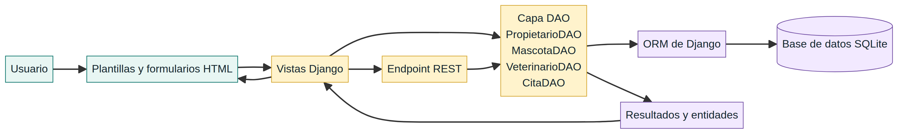
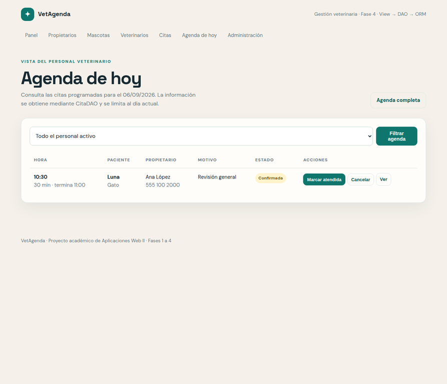
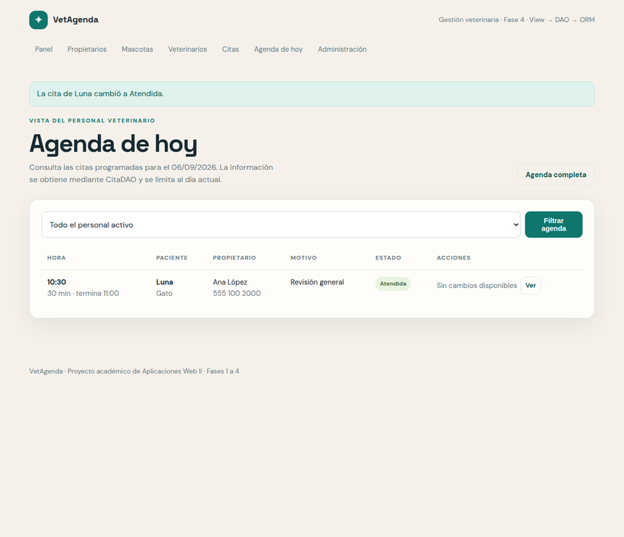
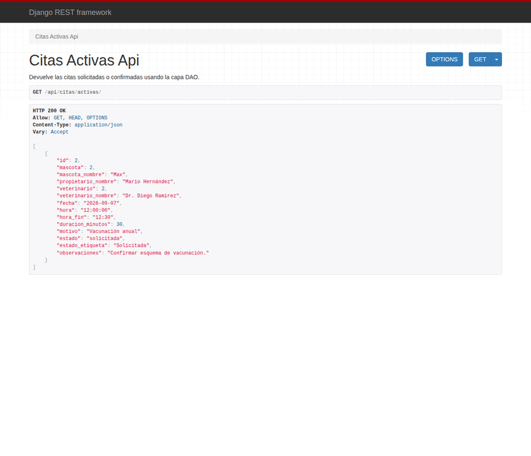

# VetAgenda — Fase 4

## Integración del entramado frontend–backend y fortalecimiento de la capa DAO

**Asignatura:** Aplicaciones Web II  
**Estudiante:** Ana Paula Flores  
**Docente:** Dra. Yuritsa Páez  
**Fecha:** 6 de septiembre de 2026  
**Repositorio:** [https://github.com/anaflrs4/vetagenda-aplicaciones-web-ii](https://github.com/anaflrs4/vetagenda-aplicaciones-web-ii)

## Resumen ejecutivo

La fase 4 fortalece la arquitectura de VetAgenda mediante una capa **DAO (Data Access Object)** real que centraliza las operaciones de persistencia. Antes de esta fase, las vistas consultaban y modificaban los modelos directamente con el ORM de Django. La retroalimentación docente indicó que la arquitectura debía reorganizarse como **View → DAO → ORM → base de datos** y que las pruebas debían demostrar que las operaciones CRUD pasan por esta capa.

La solución implementada crea cuatro objetos DAO, refactoriza todas las vistas, incorpora transiciones controladas para los estados de las citas, expone un endpoint REST de citas activas y amplía la suite a **18 pruebas automatizadas**. Las clases del 2 y 3 de septiembre señalaron que la fase debía mostrar pruebas de humo, operaciones de la capa DAO, manipulación de estados desde el frontend, respuesta satisfactoria de los endpoints y evidencia del flujo completo [1] [2].

## 1. Retroalimentación docente atendida

> “Falta incorporar y utilizar una capa DAO que centralice estas operaciones, de manera que la arquitectura quede View → DAO → ORM → Base de datos.”

| Observación | Respuesta implementada | Evidencia |
|---|---|---|
| Las vistas accedían directamente al ORM. | Se creó `citas/dao.py` y se eliminaron las consultas `Modelo.objects` de `views.py`. | `citas/dao.py` y `citas/views.py`. |
| Faltaba centralizar el CRUD. | Los DAO incluyen consultas, obtención por identificador, guardado y eliminación. | Métodos de `PropietarioDAO`, `MascotaDAO`, `VeterinarioDAO` y `CitaDAO`. |
| Era necesario demostrar el uso real del DAO. | Se agregaron pruebas con mocks que comprueban que las vistas llaman a `CitaDAO.listar()` y `CitaDAO.cambiar_estado()`. | `CapaDAOTests` en `citas/tests.py`. |
| Debía existir evidencia del flujo completo. | La agenda permite confirmar, atender o cancelar citas mediante formularios POST. | `/citas/hoy/` y capturas de esta fase. |

## 2. Objetivo y alcance de la fase 4

El objetivo de esta fase es integrar el frontend con los servicios y objetos del backend para que el usuario manipule datos sin que las vistas dependan directamente de la persistencia. La docente explicó que las pruebas deben adaptarse a los modelos de cada proyecto y pueden abarcar creación de objetos, relaciones, validaciones, DAO, roles y endpoints JSON [1]. La clase siguiente completó el flujo con métodos DAO para obtener registros activos y cambiar estados, así como pruebas que validan la capa de datos, el flujo web y la API [2].

| Incluido en la fase 4 | Reservado para fases posteriores |
|---|---|
| Capa DAO real para las cuatro entidades. | Despliegue productivo en un servidor externo. |
| Refactorización completa de vistas. | Notificaciones por correo o mensajería. |
| Cambio de estado desde el frontend. | Historial clínico avanzado y archivos médicos. |
| Endpoint REST de citas activas. | Aplicación móvil o consumo por terceros. |
| Pruebas de DAO, vistas, modelos y API. | Seguridad productiva y auditoría clínica. |

## 3. Arquitectura implementada



La capa DAO actúa como frontera entre la lógica de interacción y el ORM. Las vistas reciben solicitudes HTTP, validan los formularios y delegan la lectura o escritura al DAO. El DAO utiliza el ORM de Django, que finalmente genera las operaciones sobre SQLite. Django describe su capa de modelos como la fuente de datos y comportamiento de la aplicación, mientras que Django REST Framework permite construir respuestas HTTP estructuradas mediante vistas de API [3] [4].

| Capa | Archivos principales | Responsabilidad |
|---|---|---|
| Presentación | `templates/citas/` | Mostrar tablas, formularios, mensajes y botones de estado. |
| Vistas | `citas/views.py`, `citas/api_views.py` | Recibir solicitudes y coordinar la respuesta sin consultar directamente el ORM. |
| DAO | `citas/dao.py` | Centralizar búsquedas, conteos, CRUD, agenda, resumen y transiciones de estado. |
| ORM | `citas/models.py`, `citas/migrations/` | Mapear entidades, relaciones, validaciones y restricciones. |
| Datos | `db.sqlite3` local | Persistir propietarios, mascotas, veterinarios y citas. |

### 3.1 Comparación antes y después

| Aspecto | Antes de la fase 4 | Después de la fase 4 |
|---|---|---|
| Consulta de propietarios | `Propietario.objects...` en la vista. | `PropietarioDAO.listar()` en la vista. |
| Consulta de mascotas | `Mascota.objects...` en la vista. | `MascotaDAO.listar()` en la vista. |
| Consulta de veterinarios | `Veterinario.objects...` en la vista. | `VeterinarioDAO.listar()` y `listar_activos()`. |
| Consulta de citas | `Cita.objects...` en la vista. | `CitaDAO.listar()`, `listar_hoy()` y `listar_activas()`. |
| Guardado | `form.save()` desde la vista. | `DAO.guardar(form.save(commit=False))`. |
| Eliminación | `registro.delete()` desde la vista. | `DAO.eliminar(registro)`. |
| Cambio de estado | Edición general del formulario. | `CitaDAO.cambiar_estado()` con reglas de transición. |

## 4. Diseño de la capa DAO

| DAO | Consultas y operaciones implementadas |
|---|---|
| `PropietarioDAO` | `contar`, `listar`, `obtener_por_id`, `guardar` y `eliminar`. |
| `MascotaDAO` | `contar`, `listar` con propietario y total de citas, `obtener_por_id`, `guardar` y `eliminar`. |
| `VeterinarioDAO` | `contar_activos`, `listar`, `listar_activos`, `obtener_por_id`, `guardar` y `eliminar`. |
| `CitaDAO` | `contar`, `listar`, `listar_proximas`, `listar_activas`, `listar_hoy`, `obtener_por_id`, `resumen_estados`, `guardar`, `eliminar` y `cambiar_estado`. |

Los métodos `guardar()` llaman a `full_clean()` antes de persistir el objeto, por lo que las validaciones del modelo —incluido el control de solapamientos— siguen siendo obligatorias. Las vistas reciben objetos o conjuntos de resultados preparados por el DAO y no contienen llamadas `Modelo.objects`.

## 5. Reglas de transición de las citas

La manipulación de estados se limita a transiciones coherentes. El backend rechaza estados desconocidos y cambios no permitidos.

| Estado actual | Estados permitidos | Resultado visual |
|---|---|---|
| Solicitada | Confirmada o cancelada | Botones **Confirmar** y **Cancelar**. |
| Confirmada | Atendida o cancelada | Botones **Marcar atendida** y **Cancelar**. |
| Atendida | Ninguno | Texto “Sin cambios disponibles”. |
| Cancelada | Ninguno | Texto “Sin cambios disponibles”. |

El formulario de estado utiliza el método HTTP POST e incluye el token CSRF de Django. La vista `cita_cambiar_estado` recibe la solicitud, llama a `CitaDAO.cambiar_estado()` y devuelve un mensaje de éxito o error.

## 6. Endpoint REST

Se incorporó el endpoint de solo lectura:

```text
GET /api/citas/activas/
```

`CitasActivasAPIView` solicita los registros a `CitaDAO.listar_activas()` y `CitaSerializer` los transforma a JSON. Solo se devuelven citas con estado **solicitada** o **confirmada**. La respuesta incluye paciente, propietario, veterinario, fecha, hora inicial, hora final, duración, motivo y estado.

```json
{
  "mascota_nombre": "Max",
  "propietario_nombre": "Mario Hernández",
  "veterinario_nombre": "Dr. Diego Ramírez",
  "estado": "solicitada",
  "estado_etiqueta": "Solicitada"
}
```

## 7. Pruebas de humo y de integración

La suite final contiene **18 pruebas**. Se ejecutó con una base de datos temporal e independiente; todas finalizaron correctamente.

| Grupo | Cantidad | Cobertura principal |
|---|---:|---|
| Página principal | 1 | Respuesta HTTP y elementos del dashboard. |
| Modelos y validaciones | 3 | Relaciones, horario duplicado y solapamiento parcial. |
| Flujo web y configuración | 7 | Registro, filtros, agenda diaria, roles, dashboard y rutas. |
| DAO, vistas y API | 7 | CRUD DAO, búsquedas, transiciones, JSON y delegación desde vistas. |
| **Total** | **18** | **Resultado: OK**. |

Los comandos de verificación fueron:

```bash
python3 manage.py check
python3 manage.py makemigrations --check --dry-run
python3 manage.py test -v 2
```

Los resultados completos se encuentran en `docs/resultados-pruebas-fase4.txt`. No se detectaron problemas de configuración ni migraciones pendientes.

## 8. Evidencias visuales

### 8.1 Agenda obtenida mediante DAO



La interfaz identifica la arquitectura de la fase 4, muestra una cita confirmada y ofrece las acciones permitidas.

### 8.2 Cambio de estado aplicado



Después de ejecutar **Marcar atendida**, el backend muestra la confirmación, actualiza la etiqueta y elimina las acciones que ya no corresponden.

### 8.3 Respuesta JSON del backend



El endpoint respondió `HTTP 200 OK` y entregó una lista JSON de citas activas.

## 9. Procedimiento de reproducción

```bash
git clone https://github.com/anaflrs4/vetagenda-aplicaciones-web-ii.git
cd vetagenda-aplicaciones-web-ii
python3 -m venv .venv
source .venv/bin/activate            # Windows: .venv\Scripts\activate
pip install -r requirements.txt
python3 manage.py migrate
python3 manage.py configurar_roles
python3 manage.py cargar_demo
python3 manage.py test
python3 manage.py runserver
```

Después de iniciar el servidor se pueden revisar `/citas/`, `/citas/hoy/` y `/api/citas/activas/`.

## 10. Resultado de la fase

VetAgenda cumple el objetivo técnico señalado por la retroalimentación: las vistas ya no acceden directamente al ORM. El backend cuenta con una capa DAO reutilizable y comprobada; el frontend puede consultar citas y cambiar estados; el endpoint REST responde en JSON; y las pruebas demuestran la creación, consulta, actualización y coordinación de las capas. La arquitectura resultante mejora la separación de responsabilidades y facilita que nuevas interfaces utilicen las mismas operaciones de datos.

## Referencias

[1]: https://us06web.zoom.us/rec/play/KrKLTlejmLr_Wr_nF2ek7J17GzoG7nBGGR2RSuVOUaGcoRTTXhYz4DVyN-_Yegg7Kj2nKLCMPraqRt-n.yUahetpjyQQ9TuWy "Aplicaciones Web II, clase del 2 de septiembre de 2026"
[2]: https://us06web.zoom.us/rec/play/2dkhOqlC_l-ie2o3s9Q1CikNpzunutbO-aQ8inISwa6hrev4QEyXhHOo3NKe0HggDPLAt4eriiB87bQa.yytVfQ4KGNp7pp4t "Aplicaciones Web II, clase del 3 de septiembre de 2026"
[3]: https://docs.djangoproject.com/en/5.2/topics/db/models/ "Django documentation — Models"
[4]: https://www.django-rest-framework.org/api-guide/views/ "Django REST Framework — Class-based views"
